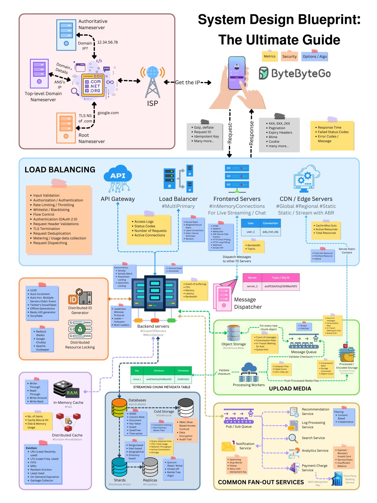
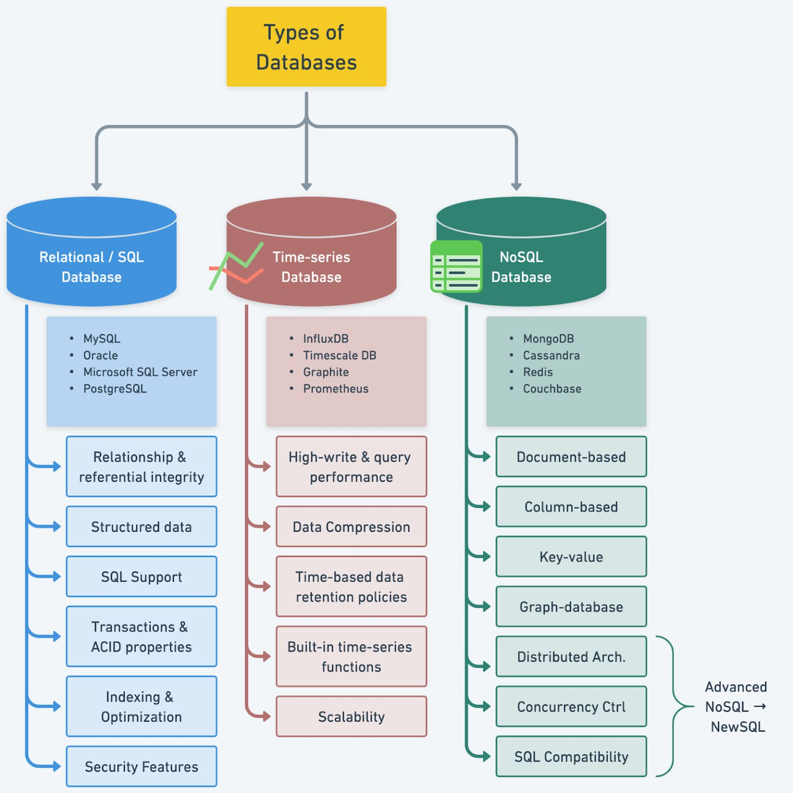
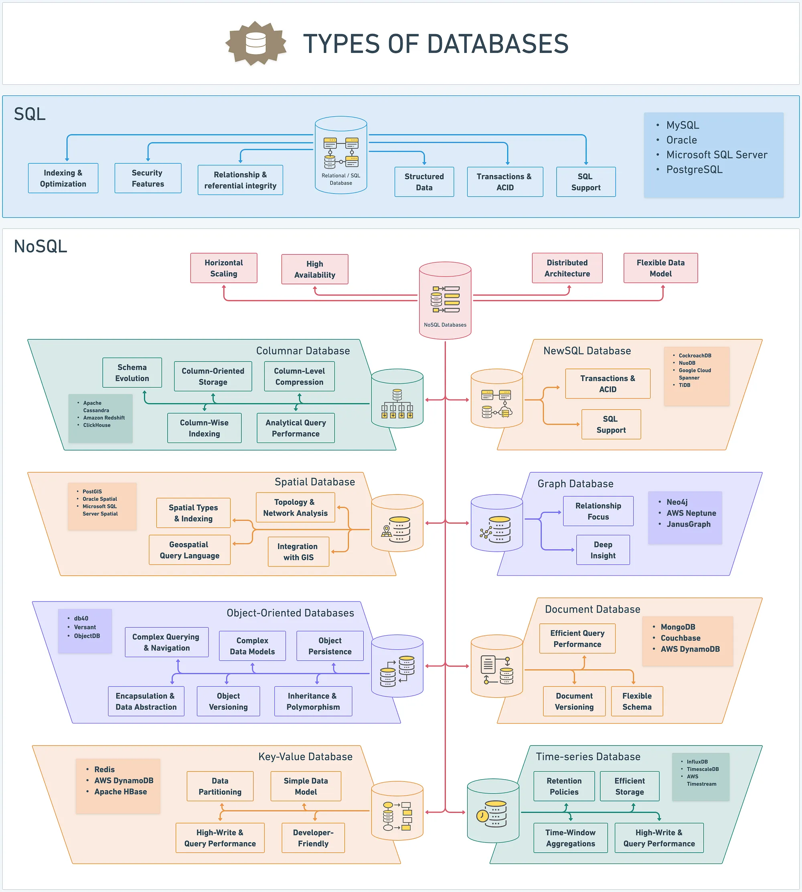

# Useful Links

## Leetcode:
- [Grind 75 leetcode problems](https://www.techinterviewhandbook.org/grind75/)
- [Mastering the 20 Coding Patterns](https://www.designgurus.io/blog/grokking-the-coding-interview-patterns)
  - [Patterns with examples](https://blog.algomaster.io/p/15-leetcode-patterns)
  - [Patterns to Master Dynamic Programming](https://blog.algomaster.io/p/20-patterns-to-master-dynamic-programming)
  - [Graph Algorithms for Coding Interviews](https://blog.algomaster.io/p/master-graph-algorithms-for-coding)

  
Leetcode patterns schema

  
  

## System Design:
- [System design roadmap](https://roadmap.sh/system-design)
- [System Design Cheatsheet](https://gist.github.com/vasanthk/485d1c25737e8e72759f)
- [Learn how to design large-scale systems (System Design Primer)](https://github.com/donnemartin/system-design-primer)
- [Понимание брокеров сообщений (ActiveMQ и Kafka)](https://habr.com/ru/post/466385/)
  - [Kafka Definitive Guide](https://www.oreilly.com/library/view/kafka-the-definitive/9781491936153/ch04.html)
  - [Log: What Every Software Engineer Should Know](https://engineering.linkedin.com/distributed-systems/log-what-every-software-engineer-should-know-about-real-time-datas-unifying)
- [Raft/Paxos Algorithm Visualization](http://thesecretlivesofdata.com/)
- [Raft/Paxos Algorithm Definition](https://medium.com/the-sixt-india-blog/raft-and-paxos-a-brief-introduction-to-the-basic-consensus-protocols-powering-distributed-systems-1a0ef7ca3acb)
- [Load Balancing](https://samwho.dev/load-balancing/#visualising-the-problem)
- [System Checklist](https://habr.com/ru/articles/583046/)
- [Distributed Transaction Patterns for Microservices](https://developers.redhat.com/articles/2021/09/21/distributed-transaction-patterns-microservices-compared)
- [Design Patterns Collection](https://github.com/DovAmir/awesome-design-patterns)
- [Algorithms for System Design Interviews](https://blog.bytebytego.com/p/algorithms-you-should-know-before)
- [Back-of-the-envelope Estimation](https://bytebytego.com/courses/system-design-interview/back-of-the-envelope-estimation)
- Redis
  - [Распределенные блокировки с применением Redis](https://habr.com/ru/company/piter/blog/518218/)
  - [Redis details](https://habr.com/ru/companies/nixys/articles/765694/)
- [Operating Systems Notes](https://github.com/blinky-z/OS-Learn)
- [Idempotent API Development](https://habr.com/ru/company/yandex/blog/442762/)
- [New API Development Experiences](https://habr.com/ru/company/yandex/blog/583332/)

  
System Design Blueprins

  
  

  
System Design Blueprins2

  
  

## Databases & ORM & SQL:
- SQL databases
   - [What Every Developer Should Know About SQL Performance](https://use-the-index-luke.com/sql/table-of-contents)
   - [Как работают реляционные базы данных](https://habr.com/ru/company/vk/blog/266811/)
   - [Блокировки в Postgres](https://habr.com/ru/company/otus/blog/452986/)
   - [Здоровье индексов в PostgreSQL глазами Java-разработчика](https://habr.com/ru/post/490824/)
   - [Цикл статей о работе Postgresql](https://habr.com/ru/company/postgrespro/blog/462877/)
   - [Transaction Isolation Levels in Postgres](https://www.thenile.dev/blog/transaction-isolation-postgres)
   - [How Databases Work](https://habr.com/ru/companies/vk/articles/266811/)
   - [О чем молчит EXPLAIN](https://habr.com/ru/company/tensor/blog/477624/)
- Hibernate :
  - [Hibernate Performance Tuning Tips](https://vladmihalcea.com/hibernate-performance-tuning-tips)

  
Database types

  
  
  
  

  

## Java:
- [Awesome Java: Curated List of Frameworks, Libraries, and Software](https://github.com/akullpp/awesome-java)
- [Java Objects Inside Out (Shipilev)](https://shipilev.net/jvm/objects-inside-out/)
  - [YouTube Video on Java Objects Inside Out](https://www.youtube.com/watch?v=3BmznLJAgaA)
- [Варим байткод на кухне JVM](https://habr.com/ru/company/domclick/blog/500646/)
- [Разборы кейсов с производительностью в Java](https://habr.com/ru/post/423305/)
- [Garbage Collection Overview](https://habr.com/ru/post/269621/)
- [Java Development Tools](https://habr.com/ru/post/471772/)
- [How to Read a Thread Dump](https://dzone.com/articles/how-to-read-a-thread-dump)
- Reactive
  - [Reactive Programming in Java](https://habr.com/ru/company/oleg-bunin/blog/543386/)
  - [Путь самурая: от Servlet к Reactive Programming](https://habr.com/ru/company/domclick/blog/504304/)
  - [NodeJS: How it Works](https://medium.com/webbdev/js-db3d35ffed7e)
- Concurrency:
  - [Deep Dive into Java Memory Model](https://habr.com/ru/articles/685518/)
  - [Code Review Checklist: Java Concurrency](https://github.com/code-review-checklists/java-concurrency)
  - [Java Concurrency and Multithreading Tutorial](http://tutorials.jenkov.com/java-concurrency/index.html)
  - [Classification and Use of Locks in Java](https://www.fatalerrors.org/a/classification-and-use-of-locks-in-java.html)
- Spring:
  - [Spring Transaction Management: @Transactional In-Depth](https://www.marcobehler.com/guides/spring-transaction-management-unconventional-guide)
  - [Bean Validation with Spring Boot](https://reflectoring.io/bean-validation-with-spring-boot/)
  - [HTTP Cache with Spring Examples](http://dolszewski.com/spring/http-cache-with-spring-examples/)
  - [Spring Integration: Dynamic Data Streams](https://habr.com/ru/post/509676/)
  - [Spring Cloud Netflix Microservices (Article Series)](https://medium.com/@kirill.sereda/spring-cloud-netflix-microservices-start-project-%D1%81%D0%B5%D1%80%D0%B8%D1%8F-%D1%81%D1%82%D0%B0%D1%82%D0%B5%D0%B9-%D1%87%D0%B0%D1%81%D1%82%D1%8C-1-7a892ad5f16)

## Authentication/Authorization:
- [Token-Based Authentication](https://gist.github.com/zmts/802dc9c3510d79fd40f9dc38a12bccfc)
- [Password Reset](https://habr.com/ru/company/vdsina/blog/523690/)
  - [Password Reset Guide Part 2](https://habr.com/ru/company/vdsina/blog/524014/)
- [Future of Authentication and Passwords](https://habr.com/ru/company/aktiv-company/blog/449442/)
- [OAuth 2.0 and OpenID Connect Explained](https://www.youtube.com/watch?v=996OiexHze0)

## Web:
- [Guide to CORS](https://grishaev.me/cors/)
- [CSRF Prevention Cheat Sheet](https://github.com/OWASP/CheatSheetSeries/blob/master/cheatsheets/Cross-Site_Request_Forgery_Prevention_Cheat_Sheet.md)
- [Browser Fingerprinting](https://habr.com/ru/company/oleg-bunin/blog/321294/)
- [How Modern Web Browsers Work](https://habr.com/ru/post/174057/)
- [What Happens When You Type google.com?](https://habr.com/ru/company/htmlacademy/blog/254825/)
- [REST API Security](https://habr.com/ru/post/503284/)
- [The Illustrated TLS Connection](https://tls13.xargs.org/)
- [Explain DNS](https://webhostinggeeks.com/guides/dns/)

## Date and Time:
- [Working with Timezones](https://habr.com/ru/company/mailru/blog/242645/)
- [Understanding Timezones](https://grishaev.me/timezone/)
- [Time Management in Java Applications](https://habr.com/ru/post/681608/)

## Common Links:
- [Encoding vs. Encryption vs. Hashing vs. Obfuscation](https://danielmiessler.com/study/encoding-encryption-hashing-obfuscation/#encoding)
- [Cryptographic Attacks](https://habr.com/ru/post/462437/)
